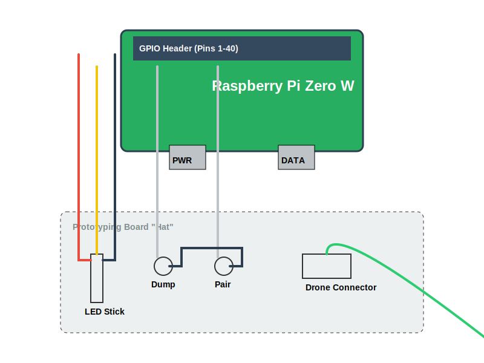

# Wiring Guide

**⚠️ WARNING:** This project involves soldering directly to the Raspberry Pi. Mistakes can damage your hardware. Proceed at your own risk.

## Overview

The wiring is split into two phases:
1.  **The Backside:** Direct USB Data connection (PP22/PP23) to allow the Pi to act as a Host to the Flight Controller.
2.  **The Topside:** The GPIO "Hat" for Buttons, LEDs, and Buzzer.

*(Note: If the SVG is not visible, refer to the text instructions below)*

## Phase 1: The "Backside" (USB Data)

This is the most critical step. We are hijacking the USB Data lines from the test pads on the back of the Pi Zero.

**Target Pads:**
*   **PP22:** USB Data + (Green Wire)
*   **PP23:** USB Data - (White Wire)

**Instructions:**
1.  **Prepare the USB Cable:** Cut a Micro USB cable. Strip the outer insulation to reveal Red, Black, Green, and White wires.
2.  **Isolate Power:** **CUT the RED (5V) wire** coming from the USB cable that plugs into the drone. We do NOT want to power the drone from the Pi or vice-versa via this cable. Connect **ONLY** Ground (Black), Data+ (Green), and Data- (White).
3.  **Solder to Pi:**
    *   Flip the Pi Zero W over (Chips facing down).
    *   Solder **Green Wire** to **PP22**.
    *   Solder **White Wire** to **PP23**.
    *   Secure wires with hot glue/tape.

## Phase 2: The "Topside" (GPIO Hat)

Connect the peripherals to the GPIO header.

| Component | Pin Function | BCM (GPIO) | Physical Pin |
| :--- | :--- | :---: | :---: |
| **LED Strip (Data)** | GPIO 18 | 18 | 12 |
| **Dump Button** | GPIO 23 | 23 | 16 |
| **Pair Button** | GPIO 24 | 24 | 18 |
| **Buzzer (+)** | GPIO 25 | 25 | 22 |
| **Grounds** | GND | - | 6, 9, 14, 20, 25 |
| **5V Power** | 5V | - | 2 or 4 |

### Connection Details

1.  **LED Strip (WS2812B):**
    *   **5V:** Connect to Pi Physical Pin 2 or 4.
    *   **GND:** Connect to Pi Physical Pin 9.
    *   **DIN (Data In):** Connect to Pi Physical Pin 12 (GPIO 18).

2.  **Buttons (Active Low):**
    *   **Dump Button:** Leg 1 to Pin 16 (GPIO 23), Leg 2 to GND.
    *   **Pair Button:** Leg 1 to Pin 18 (GPIO 24), Leg 2 to GND.
    *   *(Note: Internal Pull-Up resistors are used in software).*

3.  **Buzzer:**
    *   **Positive (+):** Connect to Pin 22 (GPIO 25).
    *   **Negative (-):** Connect to GND.

## Phase 3: Power

Power the Raspberry Pi via its dedicated **PWR** USB port (the one on the outer edge) using a Power Bank or reliable 5V source.

**Do NOT** plug the drone battery in while soldering or testing connections.
